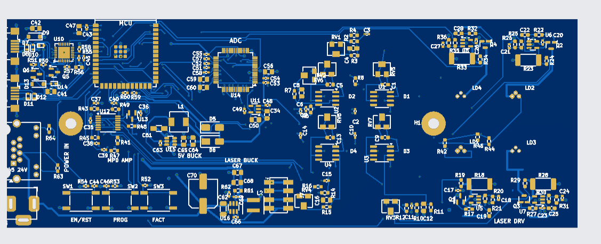

# JLCPCB Laser Controller First-Article Order

Date recorded: 2026-07-06

Scope: JLCPCB first-article PCB plus PCBA order for the laser controller.

## Status

- Order placed and paid.
- JLCPCB work order / batch: `W2026070704037950`
- PCB order: `Y57-2673627A`
- PCBA order: `SMT026070663451-2673627A`
- Invoice: `2673627A2026070704037950`
- Invoice date: 2026-07-07
- Gerber file name on JLCPCB: `laser_controller_gerbers_Y57`
- BOM file: `laser_controller_bom_jlcpcb.csv`
- CPL file: `laser_controller_pos.csv`
- Submitted: 2026-07-06 15:03 per JLCPCB order page
- Paid: 2026-07-06 15:04 per JLCPCB order page
- Status at capture: reviewing

Shipping/billing contact details, card details, phone number, email address,
street address, and tax/VAT value are intentionally not copied into git. Refer
to the JLCPCB invoice/order page for those fields.

## Order Contents

- Product: rigid populated printed circuit board
- Quantity: 5 assembled boards
- PCB build time: 3 days
- PCBA build time: 5-6 days
- Shipping method: DHL Express, DDP
- Type of trade: DDP
- Total weight: 1.2 kg
- PCB weight: 0.68 kg
- PCBA weight: 0.52 kg

## PCB Specification Captured From Order

- Base material: FR-4
- Layers: 4
- Delivery format: single PCB
- PCB thickness: 1.6 mm
- PCB color: blue
- Silkscreen: white
- Material type: FR4 TG135
- Surface finish: HASL with lead
- Via covering: plugged
- Outer copper weight: 1 oz
- Inner copper weight: 0.5 oz
- Electrical test: flying probe fully test
- Appearance quality: IPC Class 2 Standard
- Mark on PCB: remove mark
- Minimum via hole size / diameter: 0.3 mm / 0.4-0.45 mm
- Board outline tolerance: +/-0.2 mm regular
- Package box: with JLCPCB logo
- Confirm production file: no
- Shortage preference: require full quantity

The user-copied JLCPCB order text listed dimensions as `173.03 mm x 71.12 mm`.
The local archived package and Edge.Cuts audit for the committed source package
measure `173.025 mm x 61.125 mm`, matching the earlier JLCPCB preview. If the
JLCPCB DFM/review report repeats `71.12 mm`, re-check the production file before
approving any engineering question.

## PCBA Scope

- Assembly service: standard PCBA.
- Assembly side captured from order page: top side.
- JLCPCB PCBA file review captured as paid/reviewing.
- JLCPCB parser state before ordering: BOM and CPL accepted together, 60 parts
  detected, 60 parts confirmed, no unmatched parts, no inventory shortage.
- The order review used the corrected five-column JLCPCB CPL with connector
  origin/rotation corrections for the USB, RJ45, barrel jack, and J7 header
  rows.

Backside optical handling remains a first-article receipt check:

- `D1`-`D4` SFH2201 signal photodiodes are bottom-side SMT footprints. If JLCPCB
  did not include bottom-side assembly in the final DFM, hand-place or rework
  them before optical calibration.
- `LD1`-`LD4` direct laser cans are hand-installed optical parts.

## Cost

- PCB line: USD 37.20
- PCBA line: USD 432.83
- Merchandise total: USD 470.03
- Shipping: USD 51.66
- Subtotal: USD 521.69
- State sales/use tax: USD 44.99
- Customs duties and taxes: USD 164.52
- Grand total: USD 731.20

## Evidence Closure

current quote timestamp: 2026-07-06 15:03 submitted, 2026-07-06 15:04 paid.

accepted C-code: JLCPCB parser accepted the submitted BOM/CPL and confirmed all
60 detected top-side parts with no unmatched row and no inventory shortage at
the captured order quantity.

no automatic substitution: no quote-page automatic substitution was recorded at
order placement. Quote-time replacements had already been intentionally locked
in the BOM before upload (`R41` -> `C22908`, `R42/R44/R46/R48` -> `C103446`,
`C70` -> `C242011`, `J1/J2` -> `C46391`, `J5` -> `C194407`, `J6` -> `C386757`).

order archive: the committed artifacts and hashes below identify the package
used for the placed order.

## Archived Artifacts

Source commit at order record time:

```text
52c5190325bc3a2ad6cdec6fd9e6875b215e729a
```

```text
99edd53cbfd12dce3b5175e06c791c4805ac131a8c83f409c281d4962d1f306f  circuits/laser_controller_gerbers.zip
1923d2e624c5fecf20f3a804278eac854853a2d5e9b1e9ac31bfbd97530b8c29  circuits/laser_controller_jlcpcb_package.zip
0d0de72c72e62a764d51373d87a15c74c038ac83cad23bf5caaeb77b6064c286  circuits/laser_controller_bom_jlcpcb.csv
cc2a82c030d8bbb17dc394fd4fdf4b33de54d7cf10f1a0a383278b746caf655d  circuits/fab/laser_controller_pos.csv
9e6e2266a2cebb7bb652c375bdf4190f4084cacffa63eb1634251269d71d228f  circuits/fab/laser_controller_full_procurement.csv
```

## Captured JLCPCB Preview Images

Top-side JLCPCB placement / board preview captured after order placement:



```text
01eee27b21ea59ea4702960212312023ae7211f63de336fc69c854f794fb369f  circuits/review/journal/assets/2026-07-06-jlcpcb-placement-preview-top.png
```

## Follow-Up On Receipt

- Save JLCPCB DFM/review result once review completes.
- On receipt, photograph both sides before powering.
- Confirm J5/J6/J7 mechanical alignment and connector orientation.
- Confirm whether D1-D4 were assembled; if not, hand-place before optical
  calibration.
- Verify LD1-LD4 can pinout and orientation before soldering laser cans.
- Start bring-up from the first-article power, firmware, laser, and optical
  calibration templates under `circuits/review/calibration/`.
